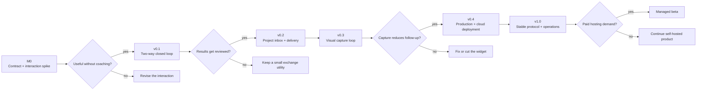
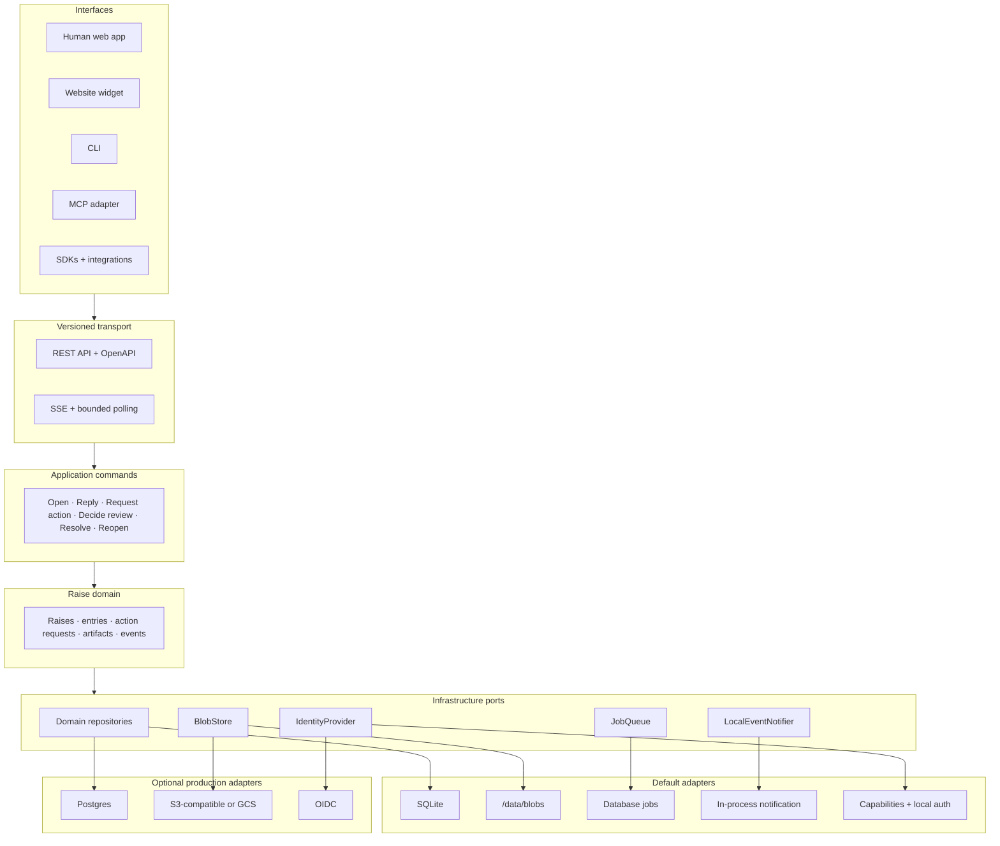

# Raise: product, architecture, and delivery plan

**Status:** Working product plan

**Date:** August 31, 2026
**Working definition:** Raise is a self-hosted context and review channel where a person or coding agent can open a request, exchange page-specific evidence, and close it with a reviewed result.

## Recommendation

Build Raise, but do not spend the first few releases assembling a screenshot host, an inbox, a feedback widget, and a review tool as separate products.

Start with one thin, closed work loop:

1. A human or agent opens a request.
2. The other participant supplies missing context.
3. The agent returns a result.
4. The human accepts it or requests changes.

v0.1 should test that whole loop with secret links, text, images, URLs, and a basic result. Later releases improve discovery, visual capture, and operations without changing the central object.

This is a better sequence than building an exact open-source clone of an image relay. The relay is a good first interaction, but it does not test why Raise should become a lasting product.

## Copy strategy

Keep vision copy separate from release copy so v0.1 does not promise a widget or page capture that it does not have.

### Vision copy

> **Raise gives people and coding agents a shared place to point at a problem, ask for missing context, and review the result.**

> Raise is the shared inbox for people and coding agents. Capture a problem where it happens, pass the context through one link, and keep questions and results in the same thread. Run it with one container and a data volume. Add Postgres or object storage when your deployment needs them.

### v0.1 release copy

> **Pass a private question, screenshot, or result between a collaborator and a coding-agent session.**

> Create a request from either side, share one link, reply, and close the loop. Self-host it with one container and one data volume.

No public README, landing page, package description, screenshot, or launch post should define Raise by comparison with another product.

## Product wedge

The first target is a developer using a coding agent on a local or staging web application, working with a designer, product manager, QA engineer, or another developer who is outside that agent session.

That distinction matters. When the human is already sitting inside the agent client, native MCP elicitation may be faster than opening another page. Raise is more useful when:

- The person with the answer is not in the agent session.
- The answer needs a screenshot, page reference, or later review.
- The exchange must survive the current terminal or chat.
- Different agent clients need the same external context channel.

In v0.1, the sender delivers the link through an existing channel such as Slack, email, or the agent chat. Raise does not try to replace those channels. v0.2 adds durable discovery and one human notification path.

## Why this is not just another widget

Individual parts already exist. [Agentation](https://www.agentation.com/) and [Pointa](https://github.com/AmElmo/pointa) attach browser element context to agent workflows. [markupR](https://github.com/eddiesanjuan/markupr) turns narrated screen recordings into structured reports. [Peek](https://github.com/puemos/peek) provides self-hosted artifact review. Current [MCP elicitation](https://modelcontextprotocol.io/specification/2026-07-28/client/elicitation) handles input during an active client request.

Raise has a reason to exist only if the combined work loop is better than handing artifacts between those tools. Its intended strengths are:

- One symmetric object and event model for humans, agents, and integrations.
- Context and results tied to the same request.
- A vendor-neutral HTTP protocol with MCP as an adapter.
- An open server that remains easy to run locally.

The parts that could compound with use are an installed capture surface, a portable packet protocol, integration compatibility, and project history that helps people resume work. None is a guaranteed moat. If usage remains occasional screenshot transfer, Raise may be a useful open-source utility and a weak cloud business. The roadmap has gates to expose that early.

Raise should send outcomes to GitHub, Linear, or another tracker when users ask. It should not replace issue tracking.

## The product unit

A `Raise` is the central object. Do not create separate storage models for agent questions, bug reports, visual reviews, or approvals.

A request contains:

| Part            | Purpose                                                               |
| --------------- | --------------------------------------------------------------------- |
| Participants    | Project-scoped human, agent, guest, or integration actors             |
| Entries         | Ordered prompts, replies, results, comments, and system events        |
| Action requests | An explicit record of who must do what next                           |
| Artifacts       | Images or supported files attached to a specific entry                |
| Context packet  | Optional page, viewport, element, annotation, and environment data    |
| Result packet   | Optional summary, change references, preview, tests, and visual proof |
| Lifecycle       | Open, resolved, cancelled, or expired                                 |
| Retention       | Expiry and verified deletion policy for records and blobs             |

Freeze one state model in M0:

```text
Raise lifecycle:
open -> resolved
open -> cancelled
open -> expired
resolved -> open       # a reopen event

Action request:
pending -> answered          # a context request
pending -> accepted          # a review request
pending -> changes_requested # a review request
pending -> cancelled
pending -> expired
```

`waiting_on` is derived from outstanding action requests, not inferred from the latest message. An action request stores the requester, target actor or actor class, originating entry, expected response type, state, and answering entry.

An agent may post a result and request review. During review, the claimant with the reviewer capability can accept, request changes, or comment while leaving the action pending. `Reopen` is reserved for moving a resolved Raise back to `open`, which creates a new action request.

Anonymous v0.1 capabilities identify a claimant, not a verified person. The server can enforce that the agent capability cannot accept a review, but it cannot prove that a human, rather than the agent operator, claimed the reviewer link. Account-backed identity in v0.2 creates the stronger human/agent boundary.

## What “two-way” means

### v0.1: symmetric content, manual discovery

Agent to human:

1. The agent calls `raise_open` with a prompt and response request.
2. Raise returns a one-time responder claim URL.
3. A human claims it and replies with text, an inert URL, or an image. That browser receives the reviewer session credential.
4. The active agent receives the answer or reads it later.
5. The agent can post a result and request review; the human accepts or requests changes.

Human to agent:

1. A human visits `/new` and opens the same kind of Raise.
2. The browser keeps the reviewer session; Raise returns a separate agent-scoped share URL and short public ID.
3. The human pastes only the agent link into the agent session.
4. The agent reads the Raise, works, and posts a result.
5. The human accepts or requests changes.

Both directions use the same records and permissions. Human-originated discovery still requires handing the link to an agent. v0.1 also uses a second manual handoff when a reviewer has closed the page: the operator sends the same review URL through the existing channel after the result is ready. This friction is intentional evidence for whether v0.2 notification work is justified.

### v0.2: durable discovery

A project inbox lets a later agent session list unread Raises. Humans receive one configured notification when an action request targets them. An active agent can wait; an offline agent can check later.

A closed local process cannot wake itself. Background wake-up needs a daemon, IDE extension, tray process, or webhook receiver. Raise should not promise always-on agents until such an adapter exists.

## Boundaries

Raise is:

- An asynchronous context and review channel for coding work.
- A compact visual issue and result record.
- A versioned HTTP API with web, MCP, CLI, and later widget interfaces.
- An open-source server that starts with one container and one volume.

Raise is not:

- General chat, a customer-support suite, or session replay.
- A replacement for GitHub Issues, Linear, or project management.
- An agent runtime, code executor, deployment service, or privileged-action approval engine.
- A reason to add many cloud services before users need them.

## Roadmap summary



| Milestone            | Behavior it proves                                                  |                        Effort estimate |
| -------------------- | ------------------------------------------------------------------- | -------------------------------------: |
| M0                   | The exchange is better than manual copy and paste                   |                      3–5 engineer-days |
| v0.1                 | Either side can create, answer, return a result, and close the loop |                     4–6 engineer-weeks |
| v0.2                 | Repeat collaborators can discover and receive work later            |                     5–7 engineer-weeks |
| v0.3                 | A minimal widget and visual packet reduce clarification             |                     6–9 engineer-weeks |
| v0.4                 | One team can operate and recover Raise locally, on AWS, or on GCP   |                    9–13 engineer-weeks |
| v1.0                 | The protocol, migrations, and operating contract are stable         |                     4–6 engineer-weeks |
| Managed private beta | Users will pay for Raise operations                                 | 10–14 engineer-weeks plus on-call work |

The path through v1.0 is about 28–42 engineer-weeks. One engineer should plan for roughly eight to eleven calendar months. Two engineers with a clean split could target five to seven months. A public managed service with billing, regional operations, support, and abuse response would require another 12–20 weeks after a private beta.

Each release has two gates:

- **Ship gate:** deterministic tests, security checks, migrations, and documentation required to tag the release.
- **Proceed gate:** observed usage that justifies starting the next milestone. It may take an unknown amount of calendar time.

## M0: contract and interaction spike

**Goal:** Validate the exchange before building durable product infrastructure.

### Experience

- An agent opens a prompt and receives a one-time responder claim URL.
- A human opens it and submits text plus one pasted image.
- The active agent receives the response.
- A human can create the same object at `/new`, retain the reviewer session, and paste a separate agent-scoped URL into an agent session.

### Build

- Define project, actor, Raise, entry, action-request, artifact, capability, and event schemas.
- Freeze the lifecycle and “who acts next” rules.
- Define capability scopes for creator, responder, reviewer, and deletion.
- Connect one MCP client to one response page.
- Draft the threat model before accepting an image.
- Confirm the business model. This plan recommends a fully open self-hosted product plus optional managed operations, with no product capability withheld for a proprietary edition.
- Choose the license path and run repository, package, domain, and trademark clearance for the common word “Raise.”

### Cuts

No accounts, inbox, annotation, widget, external storage, notifications, or public hosted service.

### Ship gate

- The two directions use the same object and event envelope.
- The default project, guest actor, actor-bound capability, and project-scoped blob rules are fixed for v0.1.
- Capability expiry and malformed-token tests pass.
- The prototype works in one current coding-agent client.

### Proceed gate

Several people outside the builders complete exchanges without coaching and prefer the flow to moving the context manually. If they do not, revise the interaction before v0.1.

## v0.1: two-way closed loop

**Goal:** Ship the smallest complete Raise product, including a result and human review.

### Why this milestone exists

Question-and-answer alone can be replaced by native agent prompts. v0.1 tests the stronger claim: an external collaborator can supply context, see what the agent did, and accept or request changes through a link.

### Experience

- Either side creates a request.
- A participant responds with text, an inert URL, or PNG/JPEG/WebP images.
- The agent posts a basic result: summary, ordinary links, and optional before/after images.
- The agent requests review from the reviewer claimant.
- The reviewer accepts, requests changes, or comments.
- The UI always shows who needs to act and the deletion time.
- If the reviewer has closed the page, the agent operator sends the existing review URL again through the original channel. v0.1 does not claim background human notification.

### Build

- One Docker image and mounted `/data` directory.
- SQLite metadata in WAL mode and project-namespaced local blob storage.
- A default instance project with guest actors for anonymous capability links.
- Web pages for create, respond, waiting, result review, resolved, expired, cancelled, and delete.
- Canonical REST API and one MCP adapter.
- Ordered event log and database-backed cleanup jobs.
- Server-Sent Events for browser updates and bounded polling as a fallback.
- Idempotency keys on create, reply, and state changes.
- Configurable retention with a proposed 24-hour anonymous default.
- A `raise backup` command with a deletion lease, SQLite snapshot, verified blob copy, and manifest, plus restore tests.
- Health and readiness endpoints.
- Upgrade continuity from the first tagged schema onward.

### MCP surface

| Tool           | Purpose                                                                                    |
| -------------- | ------------------------------------------------------------------------------------------ |
| `raise_open`   | Create a request and one action request                                                    |
| `raise_read`   | Read entries, artifacts, actions, and lifecycle                                            |
| `raise_reply`  | Add a reply or basic result                                                                |
| `raise_wait`   | Wait for a bounded period or return a task handle                                          |
| `raise_update` | Answer, request review, accept, request changes, resolve, reopen, or cancel when permitted |

Use the [MCP Tasks extension](https://modelcontextprotocol.io/extensions/tasks/overview) as the durable asynchronous handle where supported. Each MCP task represents one outstanding action request because a completed task is terminal and cannot later reopen with its parent Raise. Return the one-time responder claim URL as ordinary tool content for clients that need a browser handoff.

Do not place a secret bearer link into MCP URL-mode elicitation. The [elicitation security rules](https://modelcontextprotocol.io/specification/2026-07-28/client/elicitation#safe-url-handling) forbid URLs that pre-authenticate access to protected resources. URL-mode elicitation is suitable only for a login or pairing destination without the capability secret.

### Security floor

- Generate at least 128 bits of random capability secret and store only its hash.
- Scope each capability to one Raise, one actor, and explicit actions.
- Put the one-time secret in the URL fragment so it is not sent in the first HTTP request. The first-party page exchanges it through POST, establishes the scoped session, and removes it with `history.replaceState`.
- Consume the responder claim after the first valid response and issue a new reviewer session credential directly to that browser. This prevents accidental reuse by the model transcript, but it does not prove the claimant is a human.
- Redact capability material from application, reverse-proxy, tracing, and error logs.
- Use no third-party scripts on capability pages.
- Send a strict Content Security Policy, no-referrer, noindex, and `nosniff` headers.
- Verify image signature, MIME type, dimensions, and size; strip metadata and reject SVG, HTML, PDF, and archives in this release.
- Sanitize rendered Markdown and never render uploads as active content.
- Apply rate limits inside the application process.
- Verify expiry and deletion of records, blobs, temporary uploads, and derived thumbnails.
- State plainly that v0.1 is not end-to-end encrypted. The server can access content. Use TLS in transit and operator-managed disk encryption at rest.

### Cuts

No accounts, project inbox, pin editor, DOM capture, URL fetching, PDF, general file upload, public demo, OCR, AI summaries, voice, video, email, Slack, GitHub integration, Postgres, S3, or GCS.

A URL is stored as text. Raise never fetches it.

### Ship gate

- Both directions, result review, request changes, post-resolution reopen, restart, SSE reconnect, retry, expiry, deletion, backup, and restore pass automated tests.
- A fresh install reaches its first completed Raise in under five minutes.
- Two current coding-agent clients can use the HTTP/MCP compatibility path.
- Old capability links and records remain valid across a tested patch upgrade.

### Proceed gate

Proposed validation target: at least five real developer-collaborator pairs complete 20 cross-person context-to-result loops; at least 14 receive an explicit accept or request-changes decision; at least three pairs return in a later week. Count reviewed loops per active installation and pair, since projects do not yet exist as a user-facing concept.

If users only transfer images or answers and do not review results, keep Raise as a focused exchange utility instead of building an inbox by default.

## v0.2: project inbox and delivery

**Goal:** Let repeat collaborators find outstanding work after the original link or agent process is gone.

### Why this milestone exists

Secret links test the interaction but leave discovery manual. The inbox adds continuity. It must stay a context queue, not grow into generic work management.

### Experience

- An administrator creates a project and adds members.
- Humans and agents see Raises waiting on them, recent results, and resolved history.
- An active agent can watch; a later session can list unread action requests.
- Humans receive one configurable notification when a request needs them.
- Secret guest links remain available for outside collaborators.

### Build

- Accounts, projects, memberships, project-scoped service actors, and scoped API tokens.
- Local login with secure session cookies; OIDC remains v0.4.
- Inbox grouped by `waiting_on`, unread status, and lifecycle.
- Cursor pagination and simple filters. No full-text search.
- Token creation, rotation, revocation, and audit events.
- One human notification adapter selected from pilot demand. SMTP email is the default recommendation because it works across organizations; it can be disabled.
- Agent watch through SSE or bounded polling. Do not add outgoing agent webhooks until an actual remote-agent integration needs them.
- Per-project retention and guest-link policy.
- Migration of anonymous v0.1 records into the default project without invalidating links.

Every proposed inbox feature must answer: does this help a participant supply context, return a result, or review it? If not, leave it to the issue tracker.

### Cuts

No full-text search, saved views, assignment boards, custom statuses, typing indicators, general notification center, SSO, public widget, or GitHub integration.

### Ship gate

- Project, membership, guest, and token boundaries pass cross-tenant tests.
- Secure, HttpOnly, SameSite cookies, CSRF protection, HTTPS enforcement, and trusted-proxy behavior pass browser tests.
- Duplicate retries do not create duplicate entries or notifications.
- v0.1 capability links and records survive the migration.
- Notification failure never blocks or rolls back a request mutation.

### Proceed gate

Five outside projects use both creation directions for at least two weeks, participants discover work without repeatedly exchanging links, and at least half return in a later week. If attention still depends on manual reminders, fix delivery before building the widget.

## v0.3: visual capture loop

**Goal:** Capture a useful page-specific problem and visual result without turning Raise into session replay.

### Why this milestone exists

A screenshot lacks intent and element context. A raw DOM or network dump contains too much private and hostile data. v0.3 tests whether a small, human-reviewed packet helps the agent act with fewer questions.

This milestone combines the packet and minimal widget so it tests the end-to-end behavior. It does not build a packet format for months before anyone captures one from a page.

### Feasibility spike first

Before committing to the release estimate, test screenshot and element capture on the supported browser matrix. Page scripts cannot faithfully capture all cross-origin images, iframes, canvas content, protected media, or browser chrome. Pick the supported method, record fidelity gaps, and keep manual paste as the fallback.

### `raise.packet.v1`

| Group      | Initial fields                                                   |
| ---------- | ---------------------------------------------------------------- |
| Intent     | Note, actual behavior, expected behavior, reproduction steps     |
| Page       | Redacted URL, title, route, configured environment               |
| View       | Viewport, device pixel ratio, browser family/version             |
| Visual     | Screenshot, point or rectangle, annotation note                  |
| Element    | Selector candidates, bounding box, tag, role, short visible text |
| Build      | Optional app version, commit, or deployment label                |
| Provenance | Capture method, actor, timestamp, fields removed by redaction    |

Every field except schema version and the primary note is optional.

### Experience

- A project installs one small script and gets a corner tab, keyboard shortcut, or custom trigger.
- The reporter selects an element or region, writes a note, and inspects the outgoing packet.
- They remove or mask sensitive context before submission.
- The packet creates or replies to a request in the project inbox.
- The agent returns a summary, commit/PR URL, preview URL, and optional before/after images.
- The human accepts or requests changes through the same thread; a resolved item can later be reopened.

The default is a compact tab, not a site-wide banner. Teams can build a banner through the trigger API.

### Build

- Framework-neutral widget loader with isolated UI and lazy-loaded capture code.
- Element or region selection, one point or rectangle, and screenshot where supported.
- Human preview, field removal, masking controls, and manual screenshot fallback.
- JSON Schema and Markdown renderer for `raise.packet.v1`.
- Public create-only project identifier plus a short-lived submission session.
- Allowed browser origins, quotas, server-side rate limits, and optional bot checks for public mode.
- `[data-raise-private]`, configured exclusion selectors, and password-value blocking in capture code.
- Basic result evidence using fields already present in v0.1. No GitHub API integration; a URL is enough to test the loop.
- Packet migration tests so old entries without packets remain readable.
- Bundle-size, page-load, and interaction budgets set during the feasibility spike.

An origin check limits browser misuse but does not prove where a request came from. A non-browser caller can copy the public key and forge `Origin`. Public deployments need quotas, throttling, and, where the host application has a backend, a short-lived submission token minted for its user.

### Cuts

No React-specific wrapper, packet import API, console breadcrumbs, network logs, DOM dumps, session replay, voice, video, server-side URL screenshots, automatic code mapping, or perfect cross-origin capture.

### Ship gate

- Capture fidelity and fallback behavior are documented for each supported browser.
- Password values and configured private selectors never appear in adversarial test payloads.
- Page text is labeled untrusted in every agent representation.
- Public browser-origin checks work as documented; forged origins cannot bypass quotas or authentication controls.
- Old v0.2 entries still render after packet migrations.
- Widget performance stays within the budgets fixed at the start of the milestone.

### Proceed gate

Five outside projects install the widget on local or staging applications and complete repeated capture-to-result loops. On at least eight of ten sampled visual bugs, the packet lets the agent take a useful next step without another screenshot or restatement. At least six of ten posted results receive accept or request changes.

If the packet does not reduce follow-up, improve or cut the widget before production-hardening it.

## v0.4: production and cloud deployment

**Goal:** Let one team run and recover Raise on a single application instance, including deployments backed by AWS or GCP managed storage.

### Why this milestone exists

Pre-v0.4 deployments should be labeled experimental and single-team. Durable team data requires tested upgrades and recovery before the project invites broad production use.

### Build

- Stable migration command with forward-upgrade tests from every supported minor release.
- Postgres metadata adapter.
- Local, S3-compatible, and Google Cloud Storage blob adapters with staged upload states.
- Local accounts plus OIDC, project roles, and service accounts.
- Retention policy enforcement, audit log, quotas, administrative diagnostics, and structured logs.
- Signed webhooks only when a pilot integration requests them.
- Backup, restore, export, and import drills in release CI.
- A documented SQLite/local-blob to Postgres/object-store migration, implemented through versioned export/import or a dedicated migration command.
- A maintenance mode that rejects new writes, drains active uploads and jobs, performs migration, verifies counts/digests/event order, switches configuration, and then reopens traffic.
- A Postgres/object-store backup flow that holds the deletion lease, takes a repeatable-read logical database snapshot, records immutable object versions or generations, copies or retains referenced objects, and verifies every digest before releasing the lease.
- Docker Compose profiles for SQLite/local storage and Postgres/S3-compatible storage.
- An AWS recipe using one EC2-hosted container, RDS Postgres, and S3.
- A GCP recipe using one Compute Engine-hosted container, Cloud SQL, and Cloud Storage.
- Direct S3 and GCS uploads constrained by signed size, media type, checksum, bucket CORS, and provider-side completion verification.
- Health, readiness, metrics, and documented failure modes.
- Cookie, proxy, TLS, storage, and disaster-recovery operator guidance.

### Cuts

No multiple application instances, split web/worker roles, regional failover, billing, or public support promise.

### Ship gate

- Clean-room automation deploys each documented profile from an empty environment, completes a request, upgrades it, exports it, and restores it.
- Adapter behavior tests pass for SQLite/Postgres and local/S3-compatible/GCS blobs.
- Real AWS and GCP tests cover signed upload, immutable promotion, download authorization, and deletion.
- OIDC, tenant boundaries, retention, audit, quotas, and deletion pass release tests.
- A failed object upload or interrupted migration leaves a recoverable state.
- SQLite-to-Postgres and local-blob-to-object-store migration preserves capability grants, actor IDs, event order, entry/artifact links, and blob digests.
- Migration tests prove that maintenance mode rejects concurrent writes and drains active work before export.
- Postgres/object-store recovery restores one mutually consistent database and blob set.
- The one-container SQLite profile remains supported.

### Proceed gate

Several independent operators install, upgrade, back up, export, import, and restore the local, AWS, or GCP profiles without private help, then run weekly workloads. If one application instance meets their needs, keep improving that shape. Revisit horizontal scaling only after measured demand makes it necessary.

## v1.0: stable protocol and operating contract

**Goal:** Make compatibility, support windows, and release operations explicit.

### Build

- Versioned Raise, packet, result, event, and export schemas, plus webhook schemas only for webhook behavior that shipped before v1.0.
- Published compatibility and deprecation policy.
- SDK and adapter conformance tests.
- Contribution guide for new clients and storage adapters.
- Signed containers and release artifacts, checksums, and software bill of materials.
- Security reporting and disclosure process.
- Long-term upgrade, backup, retention, and recovery documentation.
- Trademark and branding policy.

### Ship gate

- A maintained clean-room client, written only against the published API docs, passes conformance tests.
- Every supported deployment profile passes install, upgrade, backup, restore, deletion, and failure tests.
- Release automation produces signed artifacts and migration notes.
- Compatibility promises match what maintainers can support.

Independent client implementations remain useful readiness evidence, but they do not block a deterministic release tag.

## Managed Raise

Managed hosting is an option, not the assumption behind every product decision.

### Private-beta start gate

Do not start because two users mention hosting. A stronger threshold is:

- At least ten independent teams complete Raise loops weekly for six consecutive weeks.
- At least three agree to a paid design-partner price.
- Expected revenue covers storage, support, abuse handling, backups, and on-call work at an acceptable margin.
- The team confirms that revenue comes from managed operations; the self-hosted product keeps the same product capabilities.

### Private-beta work

- One isolated single-instance stack per design-partner organization. Do not begin with a shared multi-tenant application process.
- Automated provisioning and environment isolation.
- Hosted storage, backups, upgrades, and incident tooling.
- Quotas, metering, abuse controls, and support access.
- Billing suitable for design partners.
- Service objectives and regional data policy.
- Optional custom domains and hosted notifications.

A broader public service adds hardened billing, regional operations, support workflows, and sustained incident response. Plan another 12–20 engineer-weeks after private beta; validate the estimate from beta operations.

Cloud and self-hosted editions use the same core server and protocol. Billing and operator control-plane code can be separate. Export remains available.

The private-beta service objective must state that deployments, process restarts, VM failure, and regional failure can cause downtime; there is no failover or cross-region availability promise. Horizontal scaling and higher availability are separate future decisions based on paid demand and measured load.

## Technical architecture

Use a modular monolith. A TypeScript workspace can contain the Fastify API, React/Vite web app, widget, CLI, MCP adapter, schemas, and infrastructure ports. A different stack is reasonable if the initial maintainers can ship and operate it faster; the module boundaries matter more than the framework.



### Architecture rules

1. Web, widget, CLI, and SDK clients use the versioned REST model. MCP clients speak current MCP JSON-RPC to an adapter that maps to the same application commands or REST client. `/v1/events` SSE is an application event feed, not an MCP transport.
2. Transport handlers call application commands; they do not write storage directly.
3. Domain repositories describe Raise operations. Do not create a generic query layer that pretends SQL, DynamoDB, and Firestore behave alike.
4. A mutation, its ordered event, and any notification or webhook job commit in one SQL transaction.
5. Lifecycle and action-request rows carry monotonic versions. Conditional updates prevent competing actors from answering or deciding the same action twice.
6. Blob storage is not part of the SQL transaction, so uploads move through `pending`, `ready`, or `failed` and an orphan-cleanup job.
7. Completion makes verified bytes immutable by copying from a staging locator to an immutable final locator or pinning a provider version/generation. A reusable signed upload URL never points at the final object.
8. Product code stores opaque blob IDs, never provider URLs or raw storage locators.
9. The database event log is the durable source. Notification adapters only wake consumers.
10. The base image includes no Chromium or Playwright. Any future page-rendering service is isolated and egress-restricted.

### Data model

| Table                     | Important fields                                                                                    |
| ------------------------- | --------------------------------------------------------------------------------------------------- |
| `projects`                | id, name, retention_policy, created_at                                                              |
| `accounts`                | id, identity fields, status                                                                         |
| `memberships`             | project_id, account_id, role, status                                                                |
| `actors`                  | id, project_id, account_id nullable, type, display_name                                             |
| `raises`                  | id, project_id, creator_actor_id, lifecycle, version, expires_at, timestamps                        |
| `participants`            | raise_id, actor_id, role, permissions                                                               |
| `entries`                 | id, raise_id, author_actor_id, kind, body, idempotency_key, created_at                              |
| `action_requests`         | id, raise_id, origin_entry_id, requester_actor_id, target, kind, state, version, answering_entry_id |
| `packets`                 | id, entry_id, schema_version, kind, JSON body                                                       |
| `blobs`                   | id, project_id, digest, storage_key, state, size, media_type                                        |
| `artifacts`               | id, entry_id, blob_id, display metadata                                                             |
| `annotations`             | id, artifact_id, type, geometry, note, actor_id                                                     |
| `capabilities`            | id, raise_id, actor_id, token_hash, scopes, expires_at, revoked_at                                  |
| `event_log`               | sequence, project_id, raise_id, type, payload, created_at                                           |
| `jobs`                    | id, project_id, type, payload, run_after, attempts, lease, status                                   |
| `notification_deliveries` | id, action_request_id, channel, attempts, state                                                     |

One account can join many projects through memberships. Actors are project-scoped identities; an anonymous capability authenticates a guest actor rather than creating a polymorphic participant reference. v0.1 uses a default instance project and guest actors.

Packets and artifacts belong to an entry, which preserves who supplied them and when. Local blob keys are project-namespaced. Shared digests need a blob-reference model so deleting one artifact does not remove bytes still referenced elsewhere. Downloads are authorized through the artifact and project, never through the raw storage key.

### Canonical API

Illustrative routes:

```text
POST   /v1/raises
GET    /v1/raises/:id
POST   /v1/raises/:id/entries
POST   /v1/raises/:id/action-requests
PATCH  /v1/action-requests/:id
PATCH  /v1/raises/:id/lifecycle
POST   /v1/raises/:id/artifact-uploads
POST   /v1/artifact-uploads/:uploadId/complete
GET    /v1/inbox
GET    /v1/events
DELETE /v1/raises/:id
GET    /healthz
GET    /readyz
```

List routes use cursor pagination. Mutations accept idempotency keys. Error bodies have stable codes. OpenAPI and JSON Schema are checked together in CI.

Provider-neutral upload flow:

1. Request an upload session.
2. Receive a proxied or provider-signed upload URL.
3. Upload bytes within signed limits.
4. Complete with size, digest, and provider version information when available.
5. Verify provider metadata, promote or copy bytes to an immutable final locator, mark the blob ready, and attach it to an entry.

Failed and abandoned uploads are cleaned after a grace period. Authorization never trusts a client-supplied storage key.

### Events and jobs

Every product mutation, event-log row, and required job is committed in one database transaction. State changes use expected-state and expected-version conditions; the entry, action transition, and event succeed together. After commit, the single application process wakes its local listeners. Browser clients reconnect with `Last-Event-ID`; agent clients use bounded wait, MCP Tasks where supported, or inbox polling. A restart rebuilds state from the database event log, and a cursor older than retained events triggers a full inbox resync.

Background work stays in the database. The long-running application process claims mutation-producing jobs directly, whether it runs on a laptop, ordinary server, EC2 instance, or Compute Engine VM. External commands run only while the application holds maintenance mode, so they cannot change state without the live process knowing. Redis is not part of the planned architecture.

### SQLite operating contract

- Enable WAL, foreign-key enforcement, busy timeout, and one writer process.
- Run one application process while SQLite is selected.
- Do not place the database on NFS, EFS, or another network filesystem with unsafe locking semantics.
- A raw live copy of `/data` is not the documented backup. Use a stopped-app copy or `raise backup`. The command takes a backup lease that pauses blob deletion, snapshots SQLite, copies each referenced immutable blob, verifies digests, writes a manifest, and then releases the lease.
- Test restoration before calling a backup successful.

## Deployment profiles

| Profile           | Application                     | Metadata     | Blobs                  | Maintenance              | Identity                 |
| ----------------- | ------------------------------- | ------------ | ---------------------- | ------------------------ | ------------------------ |
| Laptop/small team | One Docker container            | SQLite       | `/data/blobs`          | In-process database jobs | Capabilities/local login |
| Production host   | One container or service        | Postgres     | Local or S3-compatible | Same application process | Local/OIDC               |
| AWS               | One container on EC2            | RDS Postgres | S3                     | Same application process | OIDC provider            |
| GCP               | One container on Compute Engine | Cloud SQL    | Cloud Storage          | Same application process | OIDC provider            |

Initial settings:

```text
DATABASE_URL=file:/data/raise.db
BLOB_DRIVER=local
BLOB_PATH=/data/blobs
JOB_DRIVER=database
PUBLIC_BASE_URL=https://raise.example.com
```

Clients never know which adapters are active. Define domain ports when the local implementation needs them; add a second adapter only when the shared behavior tests exist.

DynamoDB and Firestore are poor first targets for this relational work model. Do not add them for a provider checklist. Portability comes first from the HTTP contract, versioned export, Postgres, and object-store adapters.

## Security and privacy

Raise will handle screenshots and page context from private applications. Self-hosting reduces third-party exposure but does not remove security work.

### Trust boundaries

- Capability URLs are bearer credentials and can leak through history, logs, screenshots, or referrers.
- Uploaded files, Markdown, page text, selectors, and DOM excerpts are hostile input.
- Captured page text can contain prompt injection aimed at an agent.
- A public widget credential can be copied and used outside a browser.
- Webhook destinations and any future URL fetcher can reach internal services.
- Database rows, blobs, previews, failed uploads, and exports can have different deletion timing.

### Required controls

- Hash capability and API tokens at rest, scope them, rotate them, and show guest expiry.
- Enforce project identity in repository operations, backed by composite foreign references where practical.
- Render user content as text by default. Sanitize Markdown and isolate previews on a separate origin with scripts, forms, and navigation disabled.
- Reject active file types. If HTML or SVG support is ever added, convert to a safe representation instead of serving it inline.
- Verify signatures, MIME, size, image dimensions, digest, and decode limits. Strip metadata.
- Redact URL query values and fragments by default.
- Mark page content untrusted in every agent representation.
- Never collect cookies, local storage, authorization headers, request bodies, hidden field values, complete query strings, or password values.
- Mask in the browser before upload and validate the allowed schema again on the server.
- Sign outgoing webhooks. Hosted mode blocks private, loopback, link-local, metadata, and rebinding destinations. A self-host administrator may allow exact private destinations explicitly.
- Keep server-side URL fetching off until a separate egress-restricted service exists.
- Use Secure, HttpOnly, SameSite cookies, CSRF protection, HTTPS checks, and trusted-proxy configuration for account sessions.
- Keep self-hosted telemetry off by default and provide useful local metrics.
- Verify deletion across primary records, blobs, previews, exports, logs, and incomplete uploads.

Update the threat model before accepting a new active file type, installing the widget on public sites, capturing DOM/console/network data, fetching a URL, adding external webhooks, or hosting multiple tenants.

## Test and release plan

### Automated tests

- **Domain:** lifecycle, action ownership, permissions, expiry, ordering, idempotency, retention, deletion, and competing decisions from separate connections.
- **Transactional outbox:** mutation, event, and job commit or roll back together.
- **Adapter behavior:** the same metadata, blob, job, notification, and identity rules against every implementation.
- **API compatibility:** OpenAPI, packet fixtures, old-record reads, stable errors, cursor behavior.
- **Browser journeys:** both creation directions, result review, reconnect, expiry, deletion, inbox, masking, widget fallback.
- **Failure:** restart, duplicate job, notification retry, object-store timeout, stale cursor, partial upload, post-verification overwrite attempt, and interrupted migration.
- **Recovery:** backup, restore, export, import, SQLite-to-Postgres migration, stopped-instance upgrade, restart validation, and rollback or restore.
- **Hostile input:** stored script injection, SVG/Markdown payloads, prompt injection, upload bombs, tenant substitution, forged origin, secret capture, webhook request forgery.

### Release rules

- A process restart may interrupt a live connection but cannot lose an event.
- A restart cannot duplicate an accepted response or result.
- Conditional versions allow only one competing answer or review decision to win; the loser receives a stable conflict response.
- Verified upload bytes cannot change after completion, even while the original signed upload URL remains valid.
- No password, cookie, auth header, or masked selector reaches a widget payload.
- Deleted artifacts cannot be retrieved from metadata, blob storage, or derived files.
- Each release migrates all supported prior versions and preserves active capabilities.
- A clean install reaches the interaction promised in that release.
- Never recommend an unpinned `latest` tag for production. Documentation uses a specific version and states the support level.

## Open-source and business model

### Recommendation

Use managed operations as the potential business. Keep the protocol and core self-hosted product open. Do not assume future proprietary relicensing.

If preventing closed modified hosted forks matters, use:

- **AGPL-3.0:** server and first-party web application.
- **Apache-2.0:** packet specification, widget, SDKs, MCP adapter, and CLI.

If adoption matters much more, use Apache-2.0 for the whole repository. Do not use BSL or SSPL while presenting the project as open source. Confirm the choice with counsel.

A DCO is suitable for a maintainer-led open project and managed service, but it does not collect the rights needed for unilateral proprietary relicensing. If that business model is desired, decide before accepting contributions and use appropriate contributor terms.

### Governance

- Maintainer-led decisions during early releases.
- Public RFCs for protocol, packet, storage, and breaking changes.
- Compatibility promises and migration notes before v1.0.
- Private security-reporting address and disclosure policy.
- Signed releases and SBOM when external teams deploy.
- Contribution guide centered on conformance tests and packet fixtures.
- Separate trademark policy; the software license does not force a badge.

Self-hosters can remove widget branding. A future free hosted plan may show “Powered by Raise” by default. That is a hosted-plan choice, not a source-code restriction.

## Measurement

Do not use one metric to pretend an answered question and an accepted fix are the same behavior.

| Milestone    | Primary measure                                                                                       |
| ------------ | ----------------------------------------------------------------------------------------------------- |
| M0           | Uncoached exchange completion and preference over manual transfer                                     |
| v0.1         | Cross-person context-to-result loops with explicit accept or request changes, per active install/pair |
| v0.2         | Weekly projects completing both directions and discovering work later                                 |
| v0.3         | Visual packets after which the agent proceeds without another capture                                 |
| v0.4         | Independent installs, upgrades, recovery, and real AWS/GCP deployments                                |
| Managed beta | Paid retention, support cost, storage cost, and incident load                                         |

After projects exist, the long-term product measure can be **reviewed Raise loops per weekly active project**. A reviewed loop requires activity from both sides, a delivered result, and an accept or request-changes action. Track question-only exchanges separately.

Self-hosted telemetry remains off by default. Operators get local metrics. Any usage report is opt-in and lists the fields it sends.

### Stop or redirect conditions

- If users transfer screenshots but do not review results, keep Raise a small utility.
- If native elicitation handles same-person questions, concentrate on outside collaborators, persistent context, and review.
- If the widget becomes public customer support, choose that market explicitly or resist the drift.
- If visual packets do not reduce clarification, cut fields or the widget rather than adding more capture.
- If users always review in GitHub, carry Raise context there and keep in-product review small.
- Keep one application instance until measured demand shows that it cannot serve real deployments.
- If paid hosting cannot cover support and on-call work, continue the open-source product without a cloud service.

## First 14 days

Days 1–4 are M0. Days 5–14 begin v0.1; they do not complete it.

### Days 1–2: freeze the contract

- Write the product definition and boundaries in the README.
- Draft project, actor, Raise, entry, action-request, capability, artifact, and event schemas.
- Record the two creation flows and the result-review flow.
- Decide lifecycle and review authority.
- Start license, package, domain, repository, and trademark checks.

### Days 3–4: interaction and threat spike

- Connect one MCP client to one response page.
- Test agent-originated and human-originated creation.
- Map capability leakage, image attacks, retention, deletion, prompt injection, and future widget risks.
- Interview outside users on who sends the link, who receives it, and where attention currently happens.
- Decide whether M0 passes.

### Days 5–7: persistent agent-to-human path

- Create the TypeScript workspace, API, web app, MCP adapter, schemas, migrations, and test setup.
- Implement SQLite, project-scoped guest actors, capability hashing, text reply, and pasted PNG/JPEG/WebP.
- Persist the event and action request in the same transaction.

### Days 8–10: human-to-agent and result path

- Add `/new`, agent share URL, `raise_read`, result entry, review request, accept, request changes, and post-resolution reopen.
- Confirm both creation directions use the same commands and records.
- Add bounded wait, SSE reconnect, idempotency, and explicit `waiting_on` UI.

### Days 11–12: storage and recovery

- Add staged local uploads, blob references, cleanup jobs, expiry, deletion, and health endpoints.
- Add `raise backup`, restore verification, restart tests, and the first schema upgrade test.

### Days 13–14: outside test

- Give the incomplete v0.1 flow to two or three developers without live coaching.
- Observe delivery, review, token, expiry, and responsibility failures.
- Fix interaction blockers and revise the remaining v0.1 backlog.

## Decisions for critique

1. **First collaborator:** Do we agree that the primary human is outside the agent session, such as design, PM, or QA, rather than the developer already holding the client?
2. **Manual delivery:** Is it acceptable that v0.1 uses existing chat or email to deliver the capability link, with project inbox and notification in v0.2?
3. **Closed loop:** Should v0.1 include basic result review as proposed, even if that moves it from a 2–3 week utility to a 4–6 week product test?
4. **Review authority:** Is v0.1’s claimant-based review boundary acceptable until v0.2 accounts can prove identity? The reviewer can accept or request changes; only a resolved Raise can be reopened.
5. **Retention:** Is 24 hours a reasonable anonymous default, or should unresolved Raises live longer?
6. **Widget scope:** Should v0.3 support local and staging first, with public production capture behind stronger controls?
7. **Notification:** Is SMTP email the right first human channel in v0.2, or does the target cohort live in one other channel consistently enough to choose it?
8. **License/business:** Are we building an open product plus managed operations, or do we expect proprietary enterprise features or relicensing later?
9. **Brand:** Have we cleared Raise for trademark, GitHub organization, packages, and acceptable domains before code and contributors attach to it?
10. **Cloud shape:** Are one-container EC2 and Compute Engine recipes enough for the first AWS/GCP support, backed by RDS/S3 or Cloud SQL/Cloud Storage?

## Suggested repository shape

```text
raise/
  apps/
    api/
    web/
    mcp/
    cli/
  packages/
    domain/
    schemas/
    sdk/
    widget/
    adapter-sqlite/
    adapter-local-blobs/
  deploy/
    docker/
    compose/
    examples/
  docs/
    architecture/
    protocol/
    security/
    operations/
  fixtures/
    packets/
    hostile-inputs/
```

Do not create empty cloud-adapter packages in M0. Add a port when the local implementation needs it, then add another adapter when it can pass the same behavior tests.

## Sources

- [markupR](https://github.com/eddiesanjuan/markupr)
- [Agentation](https://www.agentation.com/)
- [Pointa](https://github.com/AmElmo/pointa)
- [Peek](https://github.com/puemos/peek)
- [MCP 2026-07-28 release](https://blog.modelcontextprotocol.io/posts/2026-07-28/), [TypeScript SDK v2](https://ts.sdk.modelcontextprotocol.io/v2/), [migration guide](https://ts.sdk.modelcontextprotocol.io/v2/migration/support-2026-07-28), and [elicitation security](https://modelcontextprotocol.io/specification/2026-07-28/client/elicitation)
